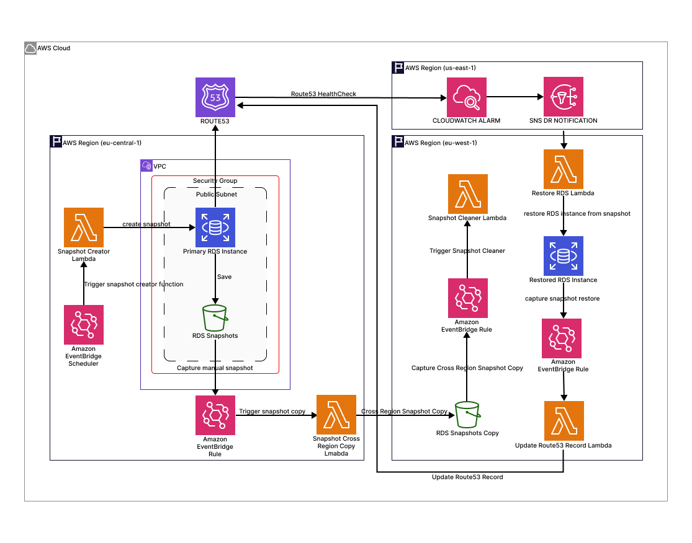

# Snapshot Resources Module

This Terraform module sets up the infrastructure for managing RDS snapshots in a disaster recovery (DR) environment. It automates the creation, copying, and cleanup of RDS snapshots across regions using AWS Lambda and EventBridge.

## Features

- **Snapshot Creation**: Automatically creates snapshots of the primary RDS instance at regular intervals.
- **Snapshot Copying**: Copies snapshots from the primary region to the disaster recovery (DR) region and deletes snapshot in primary region.
- **Snapshot Cleanup**: Deletes old snapshots based on a configurable retention period and retain the latest.
- **Monitoring**: Includes CloudWatch alarms for monitoring Lambda function errors.

## Architecture

The module consists of the following components:

1. **IAM Module**: Creates IAM roles and policies for Lambda functions.
2. **Lambda Module**: Deploys Lambda functions for snapshot creation, copying, and cleanup.
3. **EventBridge Module**: Configures EventBridge rules to trigger Lambda functions on a schedule or specific RDS events.

## Folder Structure
```
.
├── README.md
├── data.tf
├── main.tf
├── modules
│   ├── eventbridge
│   │   ├── main.tf
│   │   ├── outputs.tf
│   │   ├── providers.tf
│   │   └── variables.tf
│   ├── iam
│   │   ├── main.tf
│   │   ├── outputs.tf
│   │   └── variables.tf
│   └── lambda
│       ├── lambda_functions
│       │   ├── restore_rds_from_snapshot.py
│       │   ├── snapshot_cleaner.py
│       │   ├── snapshot_creator.py
│       │   └── snapshot_cross_region_copy.py
│       ├── main.tf
│       ├── outputs.tf
│       ├── providers.tf
│       └── variables.tf
├── outputs.tf
├── providers.tf
├── tfplan
├── tfplan.txt
└── variables.tf
```

## Usage
- Plan terraform script
```
terraform plan \
  -var="primary_region=<your-primary-region>" \
  -var="dr_region=<your-secondary-region>" \
  -var="primary_db_identifier=<your-primary-rds-instance-identifier>" \
  -var="sns_email=<your-email>"
```
- Apply terraform script
```
terraform apply \
  -var="primary_region=<your-primary-region>" \
  -var="dr_region=<your-secondary-region>" \
  -var="primary_db_identifier=<your-primary-rds-instance-identifier>" \
  -var="sns_email=<your-email>"
```
- Destroy terraform
```
terraform destroy \
  -var="primary_region=<your-primary-region>" \
  -var="dr_region=<your-secondary-region>" \
  -var="primary_db_identifier=<your-primary-rds-instance-identifier>" \
  -var="sns_email=<your-email>"
```

## Architecture Diagram


## Components Breakdown
### 1. Snapshot Creator Lambda:
- Triggered by EventBridge schedule (every 15 minutes)
- Creates snapshots in the primary region
- Tags snapshots with metadata

### 2. EventBridge (CloudWatch Events):
- Two rules:
  - Scheduled rule (triggers creator Lambda)
  - Event pattern rule (captures RDS snapshot events)

### 3. Snapshot Copy Lambda:
- Triggered by RDS snapshot completion events
- Copies snapshots to DR region
- Tags DR snapshots with source metadata

### 5. Snapshot Cleaner Lambda:
- Maintains retention policy
- Deletes old snapshots in both regions
- Keeps only the most recent snapshot

### 6. Restore Lambda:
- Restores RDS instances from snapshots in DR region

### 7. Route53 Update Record Lambda:
- Updates route53 record

## Data Flow:
### Snapshot Flow
1. Scheduled trigger → Creator Lambda → Primary RDS snapshot
2. Snapshot completion event → Eventbridge → Copy Lambda → DR region copy
3. Snapshot cross region copy event → Eventbridge → Cleaner Lambda → Primary and DR region snapshot clean up.

### Disaster Recovery Flow
1. Route53 HealthCheck → CloudWatch Alarm → SNS notification →  Restore RDS Lambda
2. Eventbridge → Route53 update record lambda → Update route53 record

## IAM Roles:
- Each Lambda has its own execution role with specific permissions

## Cross-Region Aspects:
- Primary region (eu-central-1) contains source RDS and initial snapshots
- DR region (eu-west-1) contains replicated snapshots
- CloudWatch alarm metric (us-east-1)
- Lambdas are aware of both regions through environment variables

## Prerequisites

- Terraform v1.3 or later
- AWS CLI configured with appropriate permissions
- An existing RDS instance in the primary region

## Usage

### 1. Initialize Terraform

Run the following command to initialize the Terraform configuration:

```bash
terraform init
```
### 2. Configure Variables
Create a terraform.tfvars file or pass variables directly. Example:
```
project_name            = "rds-dr"
primary_region          = "eu-central-1"
dr_region               = "eu-west-1"
primary_db_identifier   = "primary-db"
snapshot_retention_days = 7
tags = {
  Environment = "DR"
  ManagedBy   = "Terraform"
}
```
### 3. Apply the Configuration
Run the following command to deploy the resources:
```
terraform apply
```
### 4. Destroy Resources
To clean up the resources, run:

```
terraform destroy
```

### Input Variables
| Name                    | Description                                         | Type   | Default | Required |
|-------------------------|-----------------------------------------------------|--------|---------|----------|
| project_name            | Project name for resource naming                    | string | -       | ✅        |
| primary_region          | AWS region where the primary RDS instance is hosted | string | -       | ✅        |
| dr_region               | AWS region for the disaster recovery environment    | string | -       | ✅        |
| primary_db_identifier   | Identifier of the primary RDS instance              | string | -       | ✅        |
| sns_email               | Email notificationa address for disaster            | string | -       | ✅        |
| tags                    | Tags to apply to resources                          | map    | {}      | ❌        |

## Components
### IAM Module
- Creates an IAM role and policy for Lambda functions.
- Grants permissions for RDS snapshot operations and CloudWatch logging.

### Lambda Module
- Snapshot Creator: Creates manual snapshots of the primary RDS instance.
- Snapshot Copier: Copies snapshots to the DR region.
- Snapshot Cleaner: Deletes old snapshots based on the retention period.

### EventBridge Module
- Snapshot Schedule Rule: Triggers the snapshot creator Lambda every 5 minutes.
- Snapshot Completion Rule: Triggers the snapshot copier Lambda when a snapshot is completed.
- Daily Cleanup Rule: Triggers the snapshot cleaner Lambda daily at 3 AM UTC.

### CloudWatch Module
-  Sets up a CloudWatch alarm to monitor route53.

### SNS Module
- Cross region lambda trigger
- Disaster recovery email

### Route53 Module
- Create a private hosted zone
- Route53 record for primary db
- Associates DR region VPC

### Security Considerations
- Ensure the IAM role has the least privilege required for the Lambda functions.
- Review security group rules and restrict access to RDS instances as needed.
- Use KMS encryption for snapshots if required.

## Troubleshooting
1. Lambda Function Errors:
- Check the CloudWatch logs for detailed error messages.
- Verify that the IAM role has the necessary permissions.

2. EventBridge Rules Not Triggering:
- Ensure the EventBridge rules are enabled.
- Verify the target Lambda functions are correctly configured.

3. Snapshot Operations Failing:
- Check the RDS instance identifier and ensure it matches the primary DB.
- Verify cross-region permissions for snapshot copying.

## Testing Disaster recovery solution
- Run the terraform script:
```
aws cloudwatch set-alarm-state \
  --alarm-name "rds-dr-primary-db-failure" \
  --state-value ALARM \
  --state-reason "Manually testing failover" \
  --region us-east-1
```
